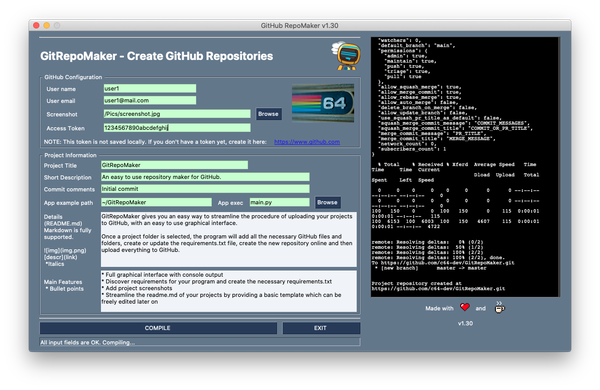

# GitRepoMaker


GitRepoMaker gives you an easy way to streamline the procedure of uploading your projects to GitHub, with an easy to use graphical interface.

Once a project folder is selected, the program will add all the necessary GitHub files and folders, create or update the requirements.txt file, create the new repository online and then upload everything to GitHub.

### Features
* Full graphical interface with console output
* Discover requirements for your program and create the necessary requirements.txt
* Add project screenshots
* Streamline the readme.md of your projects by providing a basic template which can be freely edited later on

### Installation and Updating
1. Create a folder for the application (eg. `~/GitRepoMaker`).
2. Install all required dependencies.

        python3 -m pip install -r requirements.txt

3. Run in a terminal:

        cd ~/GitRepoMaker
        git clone https://github.com/c64-dev/GitRepoMaker.git --branch master

### Update
In order to update the application, open a terminal and run:

    cd ~/GitRepoMaker
    git pull

## Usage
Go to the application's folder and run:

```
python3 screenshot.png
```

or if you are in Windows enter:

```
c:\python<PYTHON_VERSION_HERE>\python.exe screenshot.png
```

